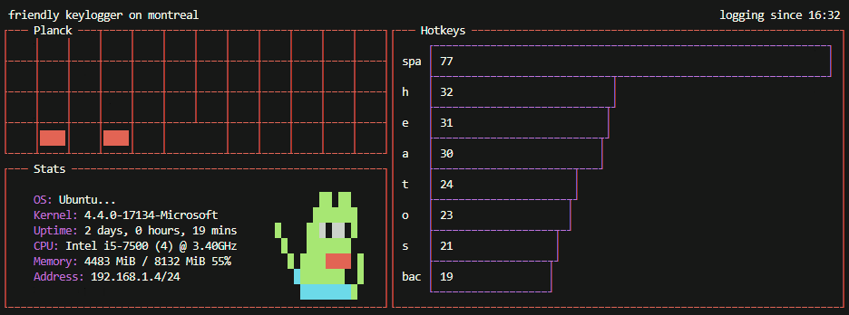

# friendlyKeylogger
Small terminal program to visualize Planck keyboard input

Due to difficulties acsessing keyboard hooks on WSL, a client and server setup is needed. Where the client runs on windows and records all keypresses, which then sends it to the program running on ubuntu WSL

Uses alot of system specifics, therefore it needs a bunch of changes to work for you. It specifically requires a windows machine, running wsl and an ortholinear 12x4 keyboard.

Warning, janky botched code.
Python3 on clientside for the simple keyboard input, writing to file.
Node reading file with bash for the speed, drawing to terminal using blessed.

**TODO:**
- Divide into classes in seperate files
- Real comments
- Make windows dynamically resize
